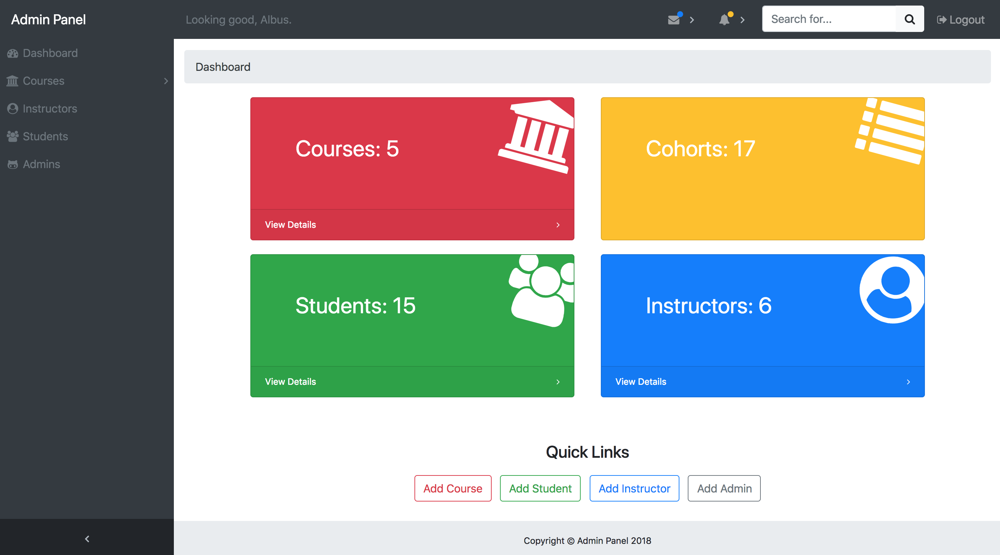
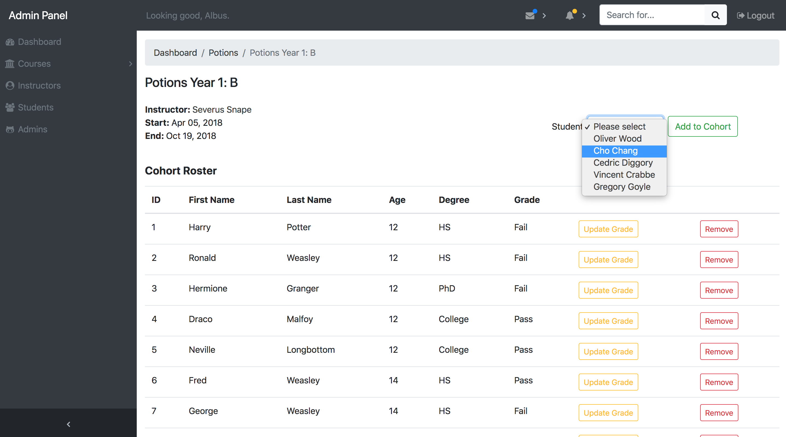

# Magic Admin Panel
## User-friendly admin panel built for a magical bootcamp

## Built with:
* Ruby on Rails
* PostgreSQL

## Demo Login:
* Username: adumbledore@hogwarts.com
* Password: muggles

User Dashboard:

Example CRUD page:

## Basic Functions:
* Authentication with Devise - two types of users: Admins (full privileges) and Instructors (limited privileges)
* Admins can CRUD students, instructors, admins, courses, and cohorts
* Instructors can only view above resources (except for salary and age data), assign/remove students to/from their own cohorts, and edit grades

## User-friendly Features:
* AJAX calls for all CRUD actions resulting in limited redirects/reloads and improved site performance
* Modal forms for all AJAX CRUD actions
* Quick links on dashboard for Admins to add resources
* Color-coordinated buttons and flash messages based on resource type and CRUD action
* Dynamically created sidenav buttons for each course and their cohorts
* Ability to add cohorts directly from sidenav for specific course
* Breadcrumbs and links throughout site to provide smooth navigation
* Meaningful icons, favicon, and signed in user identification

## Acknowledgements
* Credits: [Start Bootstrap](https://github.com/BlackrockDigital/startbootstrap-sb-admin), [Hogwarts Logo](http://arilitv.com/harry-potter-coloring-page/harry-potter-coloring-page-hogwarts-crest-pages-cute/)
* Inspiration: Harry Potter
